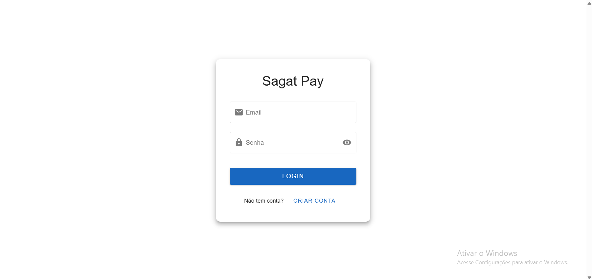
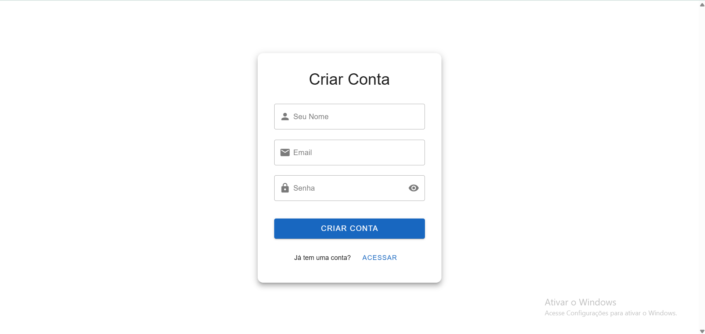
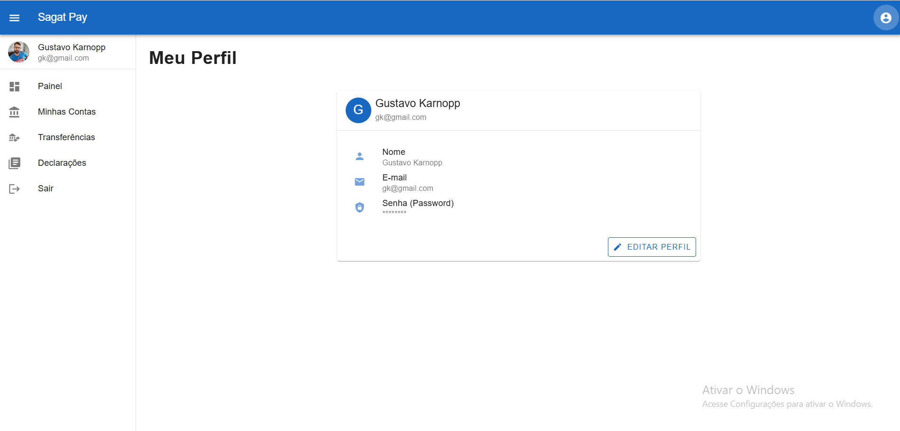
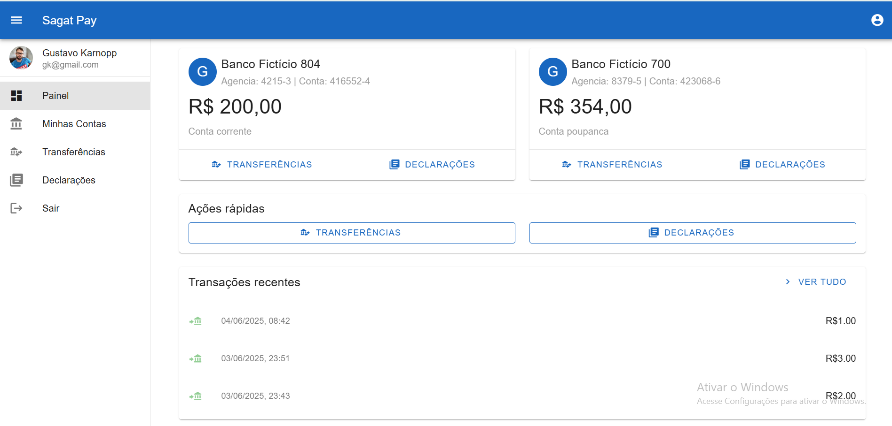
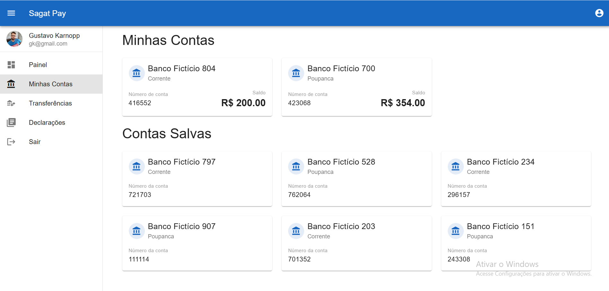
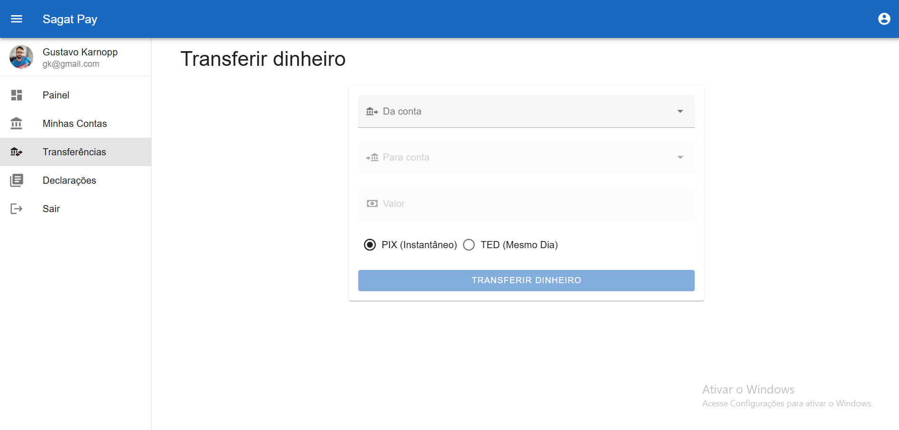
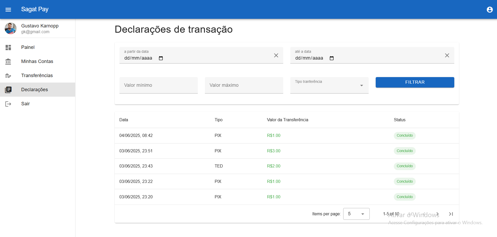

# 💸 Painel Bancário teste (Sagat pay) - Desafio Técnico Vue 3 + TypeScript + Vuetify

Seja bem-vindo(a) ao projeto desenvolvido para a segunda fase do processo seletivo!  
Este repositório contém a solução proposta para o desafio de construir um painel bancário consumindo a [API REST do SAGAT](https://github.com/jhouplaydoingles/api-rails-sagat-ai-test).

## 🧪 Tecnologias Utilizadas

- [Vue 3](https://vuejs.org/)
- [TypeScript](https://www.typescriptlang.org/)
- [Vuetify 3](https://next.vuetifyjs.com/)
- [Axios](https://axios-http.com/) para requisições HTTP
- [Vue Router](https://router.vuejs.org/) para navegação

---

## 🚀 Como Rodar o Projeto

1. **Clone o repositório:**
   ```bash
   git clone https://github.com/developerkarnopp8/sagat.ai.git
   cd sagat.ai

2. **Instale as Dependências:**
   ```bash
   npm install

3. **Configure as variáveis de ambiente:**
    Crie um arquivo .env na raiz do projeto com as seguintes variáveis
   ```bash
   VITE_API_BASE_URL=http://localhost:3000/v1

4. **Inicie o servidor de desenvolvimento:**
   ```bash
   npm run dev

OBS: A API precisa estar rodando em paralelo. Para instruções de como subir a API, consulte o repositório oficial: [API REST do SAGAT](https://github.com/jhouplaydoingles/api-rails-sagat-ai-test).

# ✅ Funcionalidades
## 1. 🔐 Autenticação
- Tela de login e cadastro
- Redirecionamento automático para o painel ao efetuar login ou cadastro com sucesso
- Persistência do token JWT com localStorage
- Proteção de rotas com guarda de autenticação

## 2. 🏦 Painel da Conta
- Exibição do nome do titular, número da conta e saldo atual
- Listagem das últimas 3 transações

## 3. 💸 Transferência Entre Contas
- Formulário com campos para número da conta de destino, valor
- Feedback de sucesso ao realizar a transferência

## 4. 📄 Extrato Completo
- Lista completa das transações com paginação
- Filtros:
    - Tipo (enviadas ou recebidas)
    - Intervalo de datas
    - Valor mínimo e máximo

# 🔗 Endpoints da API Utilizados

| Endpoint                                          | Descrição                           |
| ------------------------------------------------- | ----------------------------------- |
| `PUT /v1/auth/sign_in`                            | Login do usuário                    |
| `POST /v1/auth/sign_up`                           | Cadastro do usuário                 |
| `GET /v1/users/infos`                             | Pegar as informações do usuário     |
| `GET /v1/users/bank_accounts/my`                  | Dados da conta autenticada          |
| `GET /v1/users/bank_accounts`                     | Dados da conta salvas               |
| `POST /v1/users/bank_account_transfers`           | Realizar transferência entre contas |
| `GET /v1/users/bank_account_transfers/statements` | Listar transações com filtros       |


# 💡 O que eu faria diferente com mais tempo
- Implementaria testes unitários com Vitest ou Jest
- Criaria um sistema de notificações globais para erros e sucessos
- Implementaria dark mode e temas customizáveis

# 🤝 Agradecimentos
Agradeço pela oportunidade de participar do processo seletivo. Qualquer dúvida ou feedback será muito bem-vindo!

# Desenvolvido por
### Gustavo Karnopp
- 💼 Front-End Developer | Vue.js & Angular
- 📧 gustavokarnopp.tech@gmail.com
- 🔗 [LinkedIn](https://www.linkedin.com/in/gustavo-karnopp-039b8916b/)
- 🐙 [GitHub](https://github.com/developerkarnopp8)
- 🌐 [Portfólio](https://gustavokarnopp.vercel.app/)

### Fluxo
 [Acesse o link para o Fluxo](https://www.canva.com/design/DAGpZWIbdS8/8L_c0x_qT91-DzjJx6aCxw/watch?utm_content=DAGpZWIbdS8&utm_campaign=designshare&utm_medium=link2&utm_source=uniquelinks&utlId=h9b32f1271e)
 
 # 🔗 Prints
| Tela de Login         |                          |
| Tela Cadastro         |              |
| Perfil                |                        |
| Painel                |                        |
| Contas                |                  |
| Transferências        |                |
| Declarações           |    |
